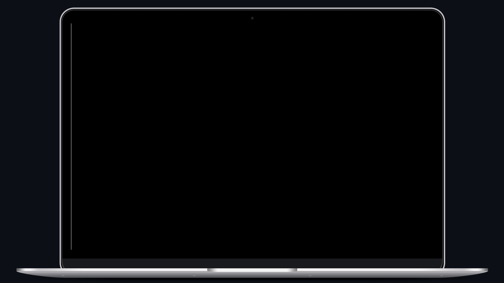

<p align="center">
  
</p>

## 🧪 Tecnologias

Esse projeto foi desenvolvido com as seguintes tecnologias:

- TypeScript
- NextJS
- Nookies
- JWT Decode

## 🚀 Uso

Clone e execute o backend na sua máquina:

```bash
git clone https://github.com/rocketseat-education/ignite-reactjs-auth-backend.git
cd ignite-reactjs-auth-backend
yarn
yarn dev
```

Clone e execute o frontend na sua máquina:

```bash
git clone https://github.com/gutemberg-jhonata/nextauth.git
cd nextauth
yarn
yarn dev
```

## 💻 Projeto

Este projeto tem como objetivo a criação de um contexto de autenticação para Nextjs.

## :memo: Licença

Esse projeto está sob a licença MIT. Veja o arquivo [LICENSE](.github/LICENSE.md) para mais detalhes.
